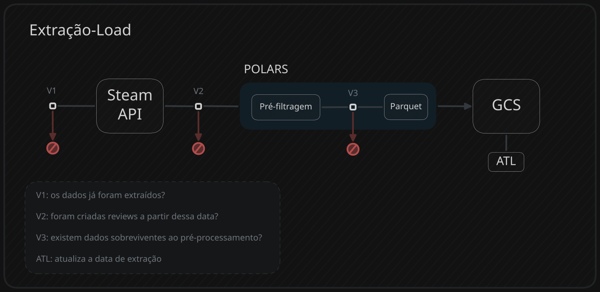

 

## Primeira Verificação(antes da extração) 

**Tabela de Logs da Extração** - (*logs_tabela_controle_extracao*) 
Para evitar duplicatas na extração e desperdiçar dinheiro, o script python verifica a data da ultima extração(dia, mes, ano) e compara com a atual. 
- **Se for igual**: insere a nova data na tabela de logs e envia um código para o workflow pular essa etapa.
- **Se for diferente**: continua o processo 

## Segunda e Terceira Verificação(na extração) 
O volume de reviews criadas na Steam pode variar muito, mas surgem 2 situações de extração que o pipeline deve estar preparado para economizar os recursos do projeto. 
1. **Nenhuma review nova foi extraída** 
2. **Nenhuma review passou pela pré-filtragem** A solução é parecida com a anterior, mas aqui **o pipeline encerra de fato**, pois não existem reviews para entrar na etapa de transformação. 

``` python
```

## A Extração
O script aplica um extração incremental, no qual só é extraido as review que foram criadas após a última execução. Após isso os dados passam por uma pré filtragem para barrar reviews que são puramente spams. 

> O processo incremental é necessário pois a API da Steam possui limitações que, dependendo da quantidade de reviews acumuladas na primeira execução do pipeline, pode gerar custos não esperados com o Cloud Run. 

não tão bem explicadas na [documentação oficial](https://partner.steamgames.com/doc/webapi_overview?l=brazilian) ou nos [termos de uso](https://partner.steamgames.com/doc/webapi_overview?l=brazilian), mas principalmente por exigir mais tempo de execução - pode impactar os custos com Cloud Run.

### Etapa 1 - Extração incremental:
*tem que passar pela primeira verificação*

1. Consulta a tabela de controle da extração e pega a maior data(unix) encontrada no lote de reviews anterior.
``` PYTHON
def get_last_extraction_date() -> int:
    """Retorna a data(UNIX) da última extração dentro da tabela de LOG."""
    # print(f"[BIGQUERY] Buscando ultimo ponto de parada em: {EXTRACTION_LOG_TABLE}")
    bq_client = bigquery.Client(project=PROJECT_ID)
    
    query = f"""
        SELECT 
        COALESCE(MAX(max_review_unix_date), 0) as last_extraction
        FROM `{EXTRACTION_LOG_TABLE}`
    """
    try:
        query_job = bq_client.query(query)
        result = query_job.result()
        for row in result:
            return int(row.last_extraction)
    except GoogleAPIError as e:
        if "Not found:" in str(e):
            print("[BIGQUERY] Tabela de log nao encontrada. Assumindo primeira execucao (Timestamp: 0).")
            return 0
        print(f"[ERRO CRITICO BQ] Falha ao ler metadados: {e}")
        raise e
```
2. Insere no request do endpoint [getreviews/](https://partner.steamgames.com/doc/store/getreviews) e extrai somente as reviews novas.

> o parâmetro "recent" no endpoint faz a API entregar as reviews da mais recente até as mais antiga, então a função só encerra quando encontrar a data da última extração.
``` PYTHON
def get_steam_reviews(data_ultima_execucao: int, client: httpx.Client, languages: str)
    # código anterior ocultado

    # Nesse ponto já foi extraido as reviews da pagina n
    finalizado = False
    for review in reviews_extraidas:
        data_review_extraida = int(review.get("timestamp_created", 0))
        
        # Enquanto a data de "hoje" for maior que a da última execução, o processo continua.
        if data_review_extraida <= data_ultima_execucao:
            finalizado = True
            break # termina a função de extração pois chegou nos dados já extraidos na última execução.
        
```
3. Atualiza a tabela controle com a nova maior data(unix) no lote extraido.

``` PYTHON
# Se nenhuma review foi extraida, a data de "hoje" é transformada em unix e enviada para a tabela de controle.

# Essa função no código é responsável por inserir a nova linha na tabela de LOGS da extração.
def insert_new_date_extraction_log(max_reviews_date: int | None = None, total_reviews_extracted: int = 0):
    """Atualiza a data da última extração inserindo uma nova linha na tabela de controle do BQ"""
    # print(f"[BIGQUERY] Atualizando log de execucao com o timestamp: {max_reviews_date}")
    
    bq_client = bigquery.Client(project=PROJECT_ID)
    
    # Captura o momento atual uma única vez para evitar micro-diferenças de milissegundos
    current_date = datetime.now(timezone.utc)
    
    # Define o valor do unix_date: usa o max_reviews_date se ele existir, caso contrário calcula o timestamp atual
    unix_date = max_reviews_date if max_reviews_date is not None else int(current_date.timestamp())

    linhas_para_inserir = [{
        "extraction_date": current_date.isoformat(timespec='seconds'),
        "max_review_unix_date": unix_date,
        "total_reviews_extracted": total_reviews_extracted
    }]
    
    errors = bq_client.insert_rows_json(EXTRACTION_LOG_TABLE, linhas_para_inserir)
    if errors:
        raise RuntimeError(f"[ERRO BQ] Falha ao inserir linha de log: {errors}")
    print("[BIGQUERY] Log de controle gravado com sucesso.")

```

### ⚠️ Atenção com a API da Steam 
A primeira execução do pipeline extrai todas as reviews existentes do jogo, por esse fato o Cloud Run fica em execução por muito mais tempo do que no estágio incremental, então para não ter surpresas é necessário entender os limites da API da Steam:

> [documentação oficial](https://partner.steamgames.com/doc/webapi_overview) e [termos de uso](https://partner.steamgames.com/doc/webapi_overview?l=brazilian)

1. Máximo de 100 reviews por requisição
2. 100.000 requisições diárias por API KEY da Steam (10 milhões de reviews) 
3. Existem limitações não especificadas na documentação oficial, mas ocorrem sobre o IP e requisições vindas de serviços cloud(GCP, AWS, Azure e etc) 
4. Rate Limit não especificado na documentação oficial, então extrações assíncronas demamdam mais estudo e riscos(a Steam é uma empresa privada).

> Supondo 100 reviews a cada 0.5s, para extrair todas as reviews do GTA 5 demoraria mais de duas horas.

### Etapa 2 - Pré-Filtragem e Parquet
A pré-filtragem serve para barrar as reviews que são puramente ruído direto da fonte e garantir integridade dos dados que vão para o bigquery ao utilizar o formato parquet.

1. Cria o dataframe do polars
2. Extrai a maior data e o total de reviews extraidas
3. Aplica as tranformações

``` PYTHON
def steam_reviews_to_polars(reviews_list: list) -> tuple[pl.DataFrame, int, int]:
    schema = {
        "recommendationid": pl.Int64,
        "timestamp_created": pl.Int64,
        "timestamp_updated": pl.Int64,
        "app_release_date": pl.Int64,
        "language": pl.Utf8,
        "review": pl.Utf8,
        "author": pl.Struct([
            pl.Field("playtime_forever", pl.Int64),
            pl.Field("playtime_last_two_weeks", pl.Int64),
            pl.Field("playtime_at_review", pl.Int64),
            pl.Field("last_played", pl.Int64)
        ])
    }

    # 1. Cria o DataFrame base para pegar a maior data e total de reviews extraidas primeiro.
    df_base = pl.DataFrame(reviews_list, schema_overrides=schema)

    # 2. Armazena o total de reviews extraidas
    total_reviews_extracted = df_base.height

    # 3. Extrai a maior data no lote das reviews
    max_date = df_base["timestamp_updated"].max()

    # 4. Transforma em LazyFrame e aplica a lógica de processamento e filtragem
    df_steam = (
        df_base
        .lazy()

        # Criando a coluna de espaços antes da Pré-Filtragem para evitar o NameError
        .with_columns([
            pl.col("review").str.count_matches(" ", literal=True).alias("spaces")
        ])

        # Pré-Filtragem
        .filter(pl.col("spaces") > 0)

        # Cria hash da review usando o plugin polars_hash
        # explicação do hash no próximo tópico.
        .with_columns([
            plh.concat_str("recommendationid", "timestamp_updated")
            .chash.sha2_256()
            .alias("hash_id")
        ])
        
        # Demais transformações de colunas
        .with_columns([
            pl.col("review").str.len_chars().alias("characters"),
            pl.col("author").struct.field("playtime_forever").alias("playtime_forever"),
            pl.col("author").struct.field("playtime_last_two_weeks").alias("playtime_last_two_weeks"),
            pl.col("author").struct.field("playtime_at_review").alias("playtime_at_review"),
            pl.col("author").struct.field("last_played").alias("last_played")
        ])

        .select([
            "hash_id",
            "recommendationid",
            "timestamp_created",
            "timestamp_updated",
            "playtime_forever",
            "playtime_last_two_weeks",
            "playtime_at_review",
            "last_played",
            "app_release_date",
            "language",
            "characters",
            "spaces",
            "review"
        ])
        .collect()
    )
    
    return df_steam, max_date, total_reviews_extracted
```

### Qual a razão do hash nas reviews?
Cada review possui um recommendationid único, porém, se o usuário atualizar o conteúdo dela, não será inserido outra review com a data atualizada, apenas o *timestamp_updated* será modificado.

Então, para melhorar a identificação é criado um hash256 unindo o **recommendationid** e **timestamp_updated**, para incluir as reviews que sofreram modificação ao longo do tempo.

> São essenciais na etapa de fragmentação-embeddings para identificar a review-mãe e fragmentos-filhos.