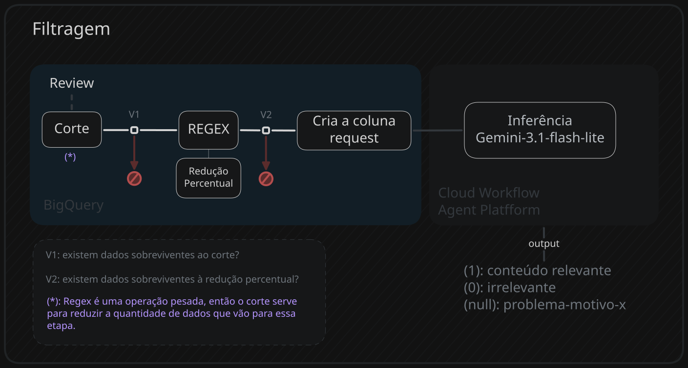

## Parte 1: Corte + REGEX
``` SQL
 WITH regex_stage AS (
	 SELECT
		-- outras colunas
		characters,
		spaces,
		TRIM(
			REGEXP_REPLACE(
				REGEXP_REPLACE(review,
				r'\[[^\]]*\]|[^a-zA-Z0-9\s.,!?;:()''"áéíóúâêîôûàèìòùãõçñ¿¡%]', ''),
				r'\s+', ' '
			)
		) AS review_after_regex
	FROM `project.dataset.raw_external_table`
	WHERE -- filtro de data ocultado
)
```
As duas colunas são geradas na pré-filtragem da extração.
``` SQL
WHERE 
spaces > 3 -- ascii arte simples, conteúdos de baixo valor e spam de caracteres sem espaçamento.
AND 
(characters - spaces) > 50 -- remove todas as reviews que não possuem mais de 50 caracteres válidos.
```

| Exemplos                                                                                                                                                                                                                               | Problemas              | Espaços |
| -------------------------------------------------------------------------------------------------------------------------------------------------------------------------------------------------------------------------------------- | ---------------------- | ------- |
| ⠀⠀⠀⠀⠀⠀⠀⣀⢠⡄⡶⣶⣶⡆⣤⣤⣤⣤⣤⣤⢠⡄⣀⠀⠀⠀⠀⠀⠀⠀<br>⠀⠀⠀⠀⠀⠀⣿⣿⢸⡇⣿⣿⣿⡇⣿⣿⣿⡿⣿⣿⢸⡇⣿⣻⣳⡆⣀⠀⠀⠀<br>⠀⠀⠀⠀⢰⡆⡿⣾⠸⠇⣿⣿⣼⡇⣿⣻⣹⣷⣿⣿⢸⡇⣿⣽⣽⡇⣿⣤⡄⠀<br>⠀⠀⠀⣀⢸⡇⣿⠿⢸⡇⣿⣿⣯⡅⣿⣿⣟⣻⣿⠿⠈⠁⠉⠉⠙⠃⠋⠈⠀⠀<br>⠀⠀⠀⣿⢘⡃⣿⣾⢸⡇⣯⣿⢿⡇⣿⣽⣹⣿⣿⠀⠀⠀⠀⠀⠀⠀⠀⠀⠀⠀<br>⠀⠀⣶⣭⠸⠇⠋⠻⢸⡇⣛⣠⡀⠀⠀⠛⢹⡟⣿⣠⠀⠀⠀⠀⠀⠀⠀⠀⠀⠀<br>⠀⠀⠛⠿⠰⠆⠀⠀⠀⠀⠛⠿⠿⠇⠀⠀⠀⠘⠿⠿⠰⠆<br> | imagens ascii          | 0       |
| aaaaaaaaaa<br>sdfsahdfuihsa<br>⭐⭐⭐⭐⭐<br>@#$%¨&!                                                                                                                                                                                        | Spam de caracteres     | 0       |
| Bom<br>:3<br>10/10<br>.                                                                                                                                                                                                                | Sem conteúdo relevante | 0       |
| nice game                                                                                                                                                                                                                              | Sem conteúdo relevante | 1       |
| painfully mediocre gameplay                                                                                                                                                                                                            | Sem conteúdo relevante | 2       |

---
### REGEX
Após o regex grande parte dos ruídos são removidos, **reduzindo** a quantidade de **caracteres e espaços.**
``` SQL
TRIM(
	REGEXP_REPLACE(
		REGEXP_REPLACE(review,
		r'\[[^\]]*\]|[^a-zA-Z0-9\s.,!?;:()''"áéíóúâêîôûàèìòùãõçñ¿¡%]', ''),
		r'\s+', ' '
	)
) AS review_after_regex
```

| Antes do Regex                                                                                | Depois do Regex                                                                                               |
| --------------------------------------------------------------------------------------------- | ------------------------------------------------------------------------------------------------------------- |
| Игра, после которой ты начинаешь подозревать друзей даже в DiscordMimesis...                  | , DiscordMimesis , , . . 3 : , , . , : , , , . : ? , , : , ,., . . . :,, , : , .:Mimesis :, , , , , .1010 . . |
| this ♥♥♥♥♥♥♥ game is ♥♥♥♥♥♥♥ ♥♥♥♥, it can't even ♥♥♥♥♥♥♥ follow a ♥♥♥♥♥♥♥ style...            | this game is , it can't even follow a style...                                                                |
| 쫄리는 맛에 하는 재밌는 게임                                                                              |                                                                                                               |
| Что вас ждётОтсутствие оптимизации: ✅...                                                      | : : : : ( , - (RTX 3070 Ti), Lethal Company, - 3- )                                                           |
| ───▄▄██▌█▀▀▀▀▀▀beep​▀▀▀▀▀▀▌       ██▌█▄▄▄▄▄▄▄delivery▄▄▄▄▄ ▄▄▌​   ▀(@)▀▀▀▀(@)(@)▀▀▀▀▀​(@)▀▀▀▀ | beep delivery                                                                                                 |

---
## Parte 2: redução percentual
Pela perca de caracteres e espaços pós regex, é utilizado a redução percentual como condição pra remover as reviews:
$$
\left( \frac{\text{antes regex} - \text{depois regex}}{\text{antes regex}} \right ) < X
$$
- *X representa o limite do corte, por exemplo: qualquer redução acima de 20%(0.2) deve ser removida*

Vai existir o ruído que perde grande parte dos espaços, mas os caracteres não reduzem o suficiente para corte, então é necessário que pelo menos uma condição seja verdadeira.

``` SQL
WHERE 
((characters - LENGTH(review_after_regex)) / NULLIF(CAST(characters AS NUMERIC), 0) < 0.2)
OR
((LENGTH(review_after_regex) - LENGTH(REPLACE(review_after_regex, ' ', ''))) < 0.1);
```

---
### Pré-Inferência(coluna request)
Para o processo de inferência é necessário ter a coluna request(exatamente com esse nome).
- **system_instruction:** prompt armazenado e versionado em uma tabela separada.
- **generationConfig:** 
	- temperature:
	- maxOutputTokens:

``` SQL
-- pós verificação de sobrevivência dos dados
SELECT
	*,
	STRUCT(
		[STRUCT(
		'user' AS role,
		[STRUCT(
			CONCAT(system_instruction, '\n', review_after_regex) AS text
		)] AS parts
		)] AS contents,
		STRUCT(
		0.5 AS temperature, 
		100 AS maxOutputTokens, 
		'application/json' AS responseMimeType
		) AS generationConfig
	) AS request
FROM Temp1;
```

### Executando a Inferência Batch
Com a coluna request criada, o cloud workflow fica responsável por criar o job de inferência no Agent Platform:

```YAML
- executar_filtragem_por_inferencia:
        call: googleapis.aiplatform.v1.projects.locations.batchPredictionJobs.create
        args:
          parent: ${"projects/" + project_id + "/locations/" + location} 
          body:
            displayName: "filtering-gemini-batch-bq-global"
            model: ${AI_model_name} 
            inputConfig:
              instancesFormat: "bigquery" # os dados saem do bigquery
              bigquerySource:
                inputUri: ${filtragem_bq_table_path} # tabela em que os dados são enviados
            outputConfig:
              predictionsFormat: "bigquery" # os dados chegam no bigquery
              bigqueryDestination:
                outputUri: ${filtragem_bq_table_path} # tabela em que os dados chegam
```
### Global vs Regional
**URL GERAL:** 
```text
https://{ENDPOINT_PREFIX}aiplatform.googleapis.com/v1/projects/{PROJECT_ID}/locations/{LOCATION}/batchPredictionJobs"
```
- **ENDPOINT_PREFIX:** se não for especificado uma região(ex: us-central-1), será utilizado o endpoint global.
- **PROJECT_ID:** nome do projeto
- **LOCATION:** região do projeto(não interfere na chamada, é apenas para encontrar o projeto)

### Inferência Batch - ATENÇÃO!
Você pode enviar os dados de uma tabela(precisa ter a coluna request) e receber os dados nela mesmo ao final do batch - a resposta gerada junto com os metadados ficam na coluna response.

> **ATENÇÃO:** se optar por inferência sem ser batch é obrigatório conhecer sobre os limites da API do Agent Platafform, do contrário seu projeto pode ser bloqueado.
> 
> **ATENÇÃO:** preste atenção às regiões do projeto, tabela, fonte e destino para evitar cobranças extras por movimentação de dados*

