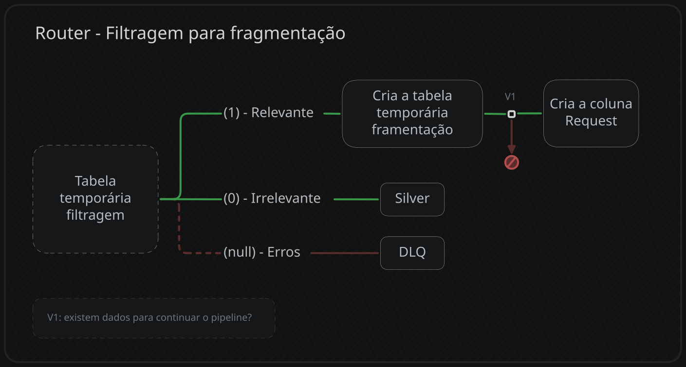

## O que ele faz?
1. Cria uma tabela temporária
2. armazena as colunas originais e expande a coluna response(resposta da ia + metadados) 
3. Direciona os dados para suas respectivas tabelas com base na resposta da coluna **Relevant**
## Como é a aparência da coluna response?
Para cada linha(review) é gerado os metadados gerados pos inferência.
``` text
{"candidates":[{"content":{"parts":[{"text":"{\"CoT\":\"Inappropriate or irrelevant content\",\"Relevant\":\"-1\"}","thoughtSignature":"ocultado por mim"}],"role":"model"},"finishReason":"STOP"}],"createTime":"2026-05-03T18:32:09.685064Z","modelVersion":"gemini-3.1-flash-lite-preview","responseId":"ocultado por mim","usageMetadata":{"billablePromptUsage":{"textCount":2005},"candidatesTokenCount":15,"candidatesTokensDetails":[{"modality":"TEXT","tokenCount":15}],"promptTokenCount":524,"promptTokensDetails":[{"modality":"TEXT","tokenCount":524}],"totalTokenCount":539,"trafficType":"ON_DEMAND"}}
```
## Transformando em colunas
``` SQL
SAFE.PARSE_JSON(response) as json_response --  permite navegação facilitada pelo JSON
```

Output na mesma célula:
``` json
{
  "candidates": [
    {
      "content": {
        "parts": [
          {
            "text": {
              "CoT": "Inappropriate or irrelevant content",
              "Relevant": "-1"
            },
            "thoughtSignature": "ocultado por mim"
          }
        ],
        "role": "model"
      },
      "finishReason": "STOP" 
    }
  ],
  "createTime": "2026-05-03T18:32:09.685064Z",
  "modelVersion": "gemini-3.1-flash-lite-preview",
  "responseId": "ocultado por mim",
  "usageMetadata": {
    "billablePromptUsage": {
      "textCount": 2005
    },
    "candidatesTokenCount": 15,
    "candidatesTokensDetails": [
      {
        "modality": "TEXT",
        "tokenCount": 15
      }
    ],
    "promptTokenCount": 524,
    "promptTokensDetails": [
      {
        "modality": "TEXT",
        "tokenCount": 524
      }
    ],
    "totalTokenCount": 539,
    "trafficType": "ON_DEMAND"
  }
}
```
### Extraindo coluna relevantes

```SQL
json_response.candidates[0].content.parts[0].text
```
Esse código apenas entrega o que está dentro da coluna text(output determinado no prompt):
 - text = {"CoT":"motivo da classificação", "Relevante": 1 ou -1}
- erros de inferência tem o campo text vazio e o finishReason podendo ser problema na quantidade de tokens, filtro de segurança ou algum outro, mas nunca STOP(processado corretamente).

Para extrair apenas as colunas específicas sem quebrar a consulta por um dado do tipo inválido,
é necessário utilizar a seguinte estrutura:
1. **LAX_STRING(text):** transforma o resultado em uma string, pois se o valor for nulo ou algum tipo incompatível é retornado **null**(vai para a DLQ) e não quebra a consulta.
2. **SAFE.PARSE_JSON(LAX...):** converte a string para json, mas em caso de erros(SAFE.) retorna null e não quebra a consulta.
3. Seleciona o campo desejado: .CoT ou .Relevant
4. **LAX_INT64():** apos o safe.parse_json os dados ainda retornam como string, então para uma conversão numérica segura é utilizado o LAX_INT64, pois em casos de erros é apenas retornado null.
> FINAL: LAX_INT64( SAFE.PARSE_JSON( LAX_STRING(text) ).relevant )

```SQL
CREATE OR REPLACE TEMP TABLE direcionamento_dados AS
	WITH dados_preparados AS (
		SELECT
		-- outras colunas
		SAFE.PARSE_JSON(response) AS json_response
		FROM `project.dataset.tabela_filtragem`
	)
	
	SELECT
	LAX_INT64(SAFE.PARSE_JSON(LAX_STRING(json_response.candidates[0].content.parts[0].text)).Relevant) AS relevant,
		LAX_STRING(SAFE.PARSE_JSON(LAX_STRING(json_response.candidates[0].content.parts[0].text)).CoT) AS cot,
		LAX_STRING(json_response.candidates[0].finishReason) AS finishReason,
		LAX_INT64(json_response.usageMetadata.promptTokenCount) AS prompt_token_count,
		LAX_INT64(json_response.usageMetadata.totalTokenCount) AS total_token_count,
		LAX_STRING(json_response.modelVersion) AS model_version
	FROM dados_preparados;
```

---
## Direcionamento dos dados
Todos os direcionamentos acontecem via Merge Into, utilizando a data e hash_id como verificação entre a fonte e destino dos dados.

> **ATENÇÂO:** se as tabelas destino não sofrerem partição, o acumulo de dados vai tornar a verificação mais cara a cada execução(ON-DEMAND do BigQuery)
---
### 0 - dados irrelevantes:
Dados irrelevantes não apresentam conteúdo útil(critérios do prompt da filtragem) para prosseguir, porém, são dados valiosos para melhorar ou criar técnicas de filtragem eficientes e descobrir falsos positivos.

> **ATENÇÃO:** a etapa de fragmentação retorna uma coluna especifica que armazena os fragmentos das reviews: ARRAY<*JSON*>. Como os dados irrelevantes não vão para essa etapa, é necessário adicionar arrays vazios no envio deles para a Silver.

> Na etapa de embeddings(depois da fragmentação) é selecionado os dados que possuem array json, mas arrays vazios(irrelevantes) são ignorados no processo de unnest, representando menos custos no modelo ON-DEMAND.

```SQL
MERGE INTO `project.dataset.Silver_Reviews` AS Silver
	USING(
		SELECT * FROM direcionamento_dados
		WHERE relevant = 0 -- SELECIONA APENAS DADOS IRRELEVANTES
	) AS source
	ON Silver.data_referencia BETWEEN data_inicio AND data_fim -- utiliza a partição
	AND Silver.hash_id = source.hash_id -- utiliza o clustering
	WHEN NOT MATCHED THEN -- se o hash_id não existir na tabela destino, ele adicona
		INSERT (
		-- outras colunas
			AIstruct_array
		) 
		VALUES (
		-- mesmas colunas do insert ()
			ARRAY<JSON>[] -- OBRIGATÓRIO
		);
```
---
### Dados Irrelevantes(0) Relevantes(1)
#### Verificação:
O pipeline só continua se existir dados marcados como relevantes(1)

```SQL
--- Só é possível utilizar as condições lógicas em procedures sql
	DECLARE v_count_relevantes INT64 DEFAULT 0;
	-- faz a contagem de dados marcados como relevant = 1
	SET v_count_relevantes = (
		SELECT COUNT(1) 
		FROM direcionamento_dados 
		WHERE relevant = 1
	);
```
#### Sem dados relevantes( v_count_relevantes = 0 )
Essa procedure de router foi criada para retornar o status de continuidade do pipeline. Se não houver dados relevantes, o status é definido como "SEM_DADOS_RELEVANTES" e ao final, o Cloud Workflow entende que é para concluir o pipeline e atualizar a data.

``` SQL
--- Só é possível utilizar as condições lógicas em procedures sql
CREATE OR REPLACE PROCEDURE `project.dataset.2_PRC_pre_fragmentacao`(OUT status_continuidade STRING, OUT motivo STRING)
	-- . outros processos
	-- . outros processos
	-- . outros processos
	-- verificação v_count_relevantes
	
	IF v_count_relevantes = 0 THEN
		CALL `project.dataset.PRC_logs_control_table`(4);
        SET status_continuidade = 'ENCERRAR';
        SET motivo = 'Direcionamento - sem dados relevantes para fragmentação';
        RETURN; -- encerra a procedure aqui mesmo.
	ELSE
	-- proxima parte
```
---
#### Possui dados relevantes ( v_count_relevantes = 1)

```SQL
ELSE
	-- Essa parte só executa se existir dados para fragmentação
	
	-- Busca o prompt versionado na tabela de prompts
	SET v_system_instruction = (
		SELECT system_instruction
		FROM `project.dataset.config_prompts`
		WHERE prompt_id = 'split_reviews' 
		  AND status = 'PRODUCTION'
	);
	
	-- Cria a coluna request para a inferência de fragmentação - dados garantidos como relevantes
	CREATE OR REPLACE TABLE temporaria_2 AS
		SELECT 
			-- outras colunas
			STRUCT(
				[STRUCT(
					'user' AS role,
					[STRUCT(
						CONCAT(v_system_instruction, '\n', review_after_regex) AS text
					)] AS parts
				)] AS contents,
				STRUCT(
					0.5 AS temperature, 
					100 AS maxOutputTokens, 
					'application/json' AS responseMimeType
				) AS generationConfig
			) AS request -- não trazer a request da filtragem
		FROM direcionamento_dados
		WHERE relevant = 1;
END IF;
```
---
### null - DLQ
Nada de especial, apenas envia os erros para a DLQ
``` SQL
MERGE INTO `project.dataset.DLQ_reviews` AS DLQ
    USING(
        SELECT
            batch_id, 
            ingested_at,
            hash_id, 
            review_after_regex AS payload,
            CURRENT_TIMESTAMP() AS updated_at,
            "Classificação Relevância" AS error_checkpoint,
            finishReason AS AI_finishReason,
            0 AS retry_count
        FROM direcionamento_dados
        WHERE relevant IS NULL -- PEGA OS ERROS
    ) AS source
    ON DLQ.data_referencia BETWEEN data_inicio AND data_fim -- utiliza a partição
    AND DLQ.hash_id = source.hash_id -- utiliza o clustering
    WHEN NOT MATCHED THEN
        INSERT (
            batch_id, 
            ingested_at,
            hash_id,
            payload,
            updated_at, 
            error_checkpoint, 
            AI_finishReason,
            retry_count            
        ) 
        VALUES (
            source.batch_id, 
            source.ingested_at,
            source.hash_id, 
            source.payload,
            source.updated_at,
            source.error_checkpoint,
            source.AI_finishReason,
            source.retry_count
        );
```