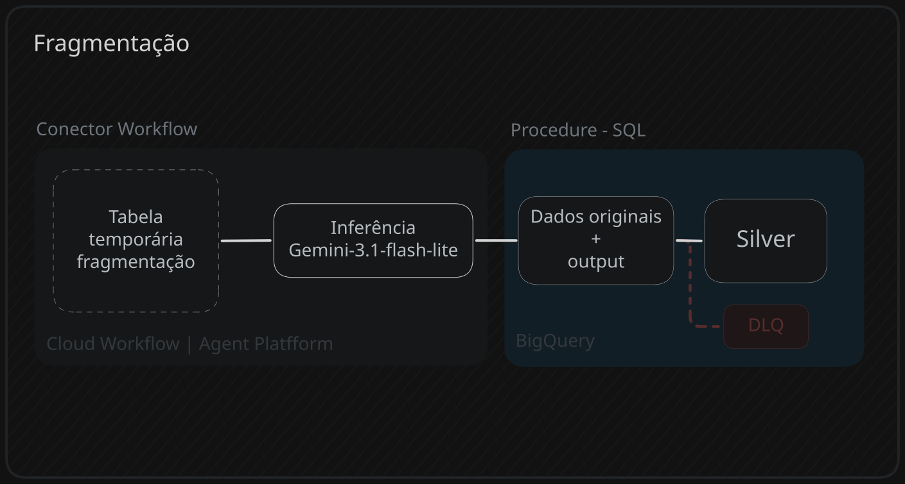

## Papel do router(etapa anterior)
O router garante 2 processos:
1. O pipeline só chega na etapa de fragmentação se houver dados relevantes.
2. Após a confirmação da existência, é criado a tabela temporária junto com a coluna request e o prompt específico para framentação.
---

### Transformando a resposta da IA em array de fragmentos
#### Expansão
```SQL
CREATE OR REPLACE TEMP TABLE Struct AS
	WITH parsed_data AS (
		SELECT
			-- outras colunas
			PARSE_JSON(response) AS json_response
		FROM `project.dataset.temporaria_2`
	)
	SELECT
		-- outras colunas
		ARRAY( -- ver explicação
			SELECT PARSE_JSON(LAX_STRING(part.text))
			FROM UNNEST(JSON_QUERY_ARRAY(json_response.candidates[0].content.parts)) AS part
		) AS AI_struct_array,
		-- outras colunas de metadados
	FROM parsed_data;
```
#### Explicação
``` JSON
-- Pós PARSE_JSON(response)
{
  "candidates": [
    {
      "content": {
        "parts": [
          {
            "text": [{frag_1},{frag_2},{frag_3}],
            "thoughtSignature": ...
          }
        ],
    .
    .
    .
    .
```

``` SQL
json_response.candidates[0].content.parts.text
aponta apenas para a lista de jsons: [{frag_1},{frag_2},{frag_3}]
```

```SQL
ARRAY( -- transforma as linhas em um array de fragmentos
	SELECT ai_struct_list
	FROM UNNEST( -- explode as linhas
	    JSON_QUERY_ARRAY( -- extrai a lista de jsons
			PARSE_JSON( -- transforma a string em objeto json
				LAX_STRING( -- transforma a resposta em string, em caso de erro -> null
					json_response.candidates[0].content.parts.text
				)
			)
		)
	) as AI_struct_array
)
```

---
### Direcionamento dos dados

#### Silver
``` SQL
MERGE INTO `project.dataset.Silver_Reviews` as Silver
    USING(
        select * from Struct
        where AI_struct_array IS NOT NULL
    ) AS source

ON Silver.data_referencia BETWEEN data_inicio AND data_fim -- utiliza a partição de dada
AND Silver.hash_id = source.hash_id -- utiliza o clustering

    WHEN NOT MATCHED THEN
        INSERT (
			-- outras colunas
            AIstruct_array
        ) 
        VALUES (
			-- outras colunas
            source.AI_struct_array   
        );
```

#### DLQ
```SQL
MERGE INTO `project.dataset.DLQ` as DLQ
    USING(
        select
            batch_id,
            ingested_at,
            hash_id, 
            review_after_regex as payload,
            CURRENT_TIMESTAMP() as updated_at,
            "Split_Review" as error_checkpoint,
            finishReason as AI_finishReason,
            0 as retry_count
        from Struct
        where AI_struct_array IS NULL
    ) AS source
    ON DLQ.ingested_at BETWEEN data_inicio AND data_fim
    AND DLQ.hash_id = source.hash_id
    WHEN NOT MATCHED THEN
        INSERT (
            batch_id,
            ingested_at,
            hash_id,
            payload,
            updated_at, 
            error_checkpoint, 
            AI_finishReason,
            retry_count            
        ) 
        VALUES (
            source.batch_id,
            source.ingested_at,
            source.hash_id, 
            source.review_after_regex,
            source.updated_at,
            source.error_checkpoint,
            source.AI_finishReason,
            source.retry_count
        );
```