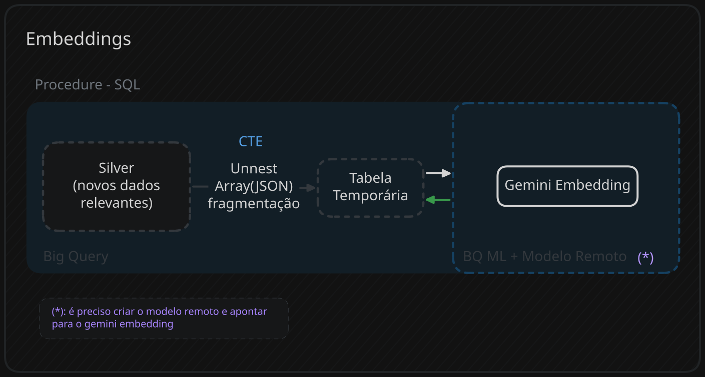

### Introdução:
Após a conclusão da etapa de fragmentação e seu direcionamento dos dados para a silver, é necessário selecionar apenas esses dados novos e passar para a etapa de embeddings
```SQL
-- DENTRO DA PROCEDURE
	DECLARE max_date_processed DATE;
	-- pega a maior data processada no estágio de embeddings - particionada por data
    SET max_date_processed = (
        SELECT MAX(max_processed_timestamp)
        FROM `project.dataset.control_table`
        WHERE pipeline_step = 'unnest_to_embedding'
    );
```
---
### Preparando os dados
1. Dados selecionados após a última execução bem sucedida
2. A coluna de arrays json sofre unnest
3. No unnest é feito o WITH OFFSET para registrar a posição de cada fragmento dentro do array.
4. Com o id de posição(gerado pelo offset) e hash_id(review original) é criado um id único para cada fragmento.
> Os ai_frag_id são cruciais para a etapa posterior(classificação).
``` SQL
CREATE OR REPLACE TABLE `project.dataset.unnest_struct_silver`
	WITH reviews_splited AS (
		SELECT
			-- outras colunas
			FARM_FINGERPRINT(CONCAT(CAST(hash_id AS STRING), '|', CAST(array_position AS STRING))) AS ai_frag_id,

			JSON_VALUE(item_json.f) AS content, -- vira coluna
			JSON_VALUE(item_json.c) AS category, -- vira coluna
			JSON_VALUE(item_json.t) AS topic, -- vira coluna
			SAFE_CAST(JSON_VALUE(item_json.s) AS INT64) AS sentiment -- vira coluna
		FROM `project.dataset.Silver_Reviews`,
		UNNEST(AIstruct) AS item_json WITH OFFSET AS array_position
		WHERE ingested_at > max_date_processed
	)
``` 
---
### Gerando Embeddings - BQ ML + Modelo Remoto
##### Criando modelo remoto
> Atenção à região do modelo criado e o suporte dela pelo endpoint
``` SQL
CREATE OR REPLACE MODEL `project.dataset.remote_model_name` 
REMOTE WITH CONNECTION `project.region.connection_name`
OPTIONS(
	ENDPOINT = 'gemini-embedding-001' --modelo de embedding
);
```
##### Chamando o modelo e gerando os embeddings
``` SQL
SELECT 
	*, 
	ml_generate_embedding_result AS embedding 
	FROM ML.GENERATE_EMBEDDING(
		MODEL `project.dataset.remote_model_name`,
		(
			SELECT
				hash_id, -- id da review pai
				recommendation_id, -- id original da review na steam
				ai_split_id, -- crucial para classificação
				date_created,
				content, -- (resumo do fragmento)
				category, -- (temas gerais do jogo)
				topic, -- (UX ou DEV)
				sentiment -- (1, -1 ou 0)
			FROM reviews_splited
		),
		STRUCT('SEMANTIC_SIMILARITY' AS task_type, 256 AS OUTPUT_DIMENSIONALITY)
);
```