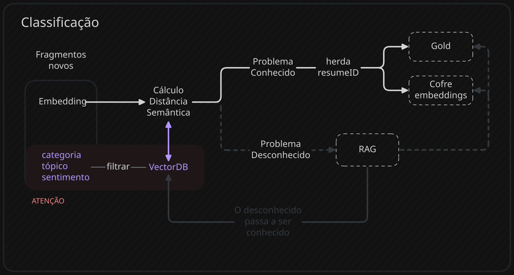
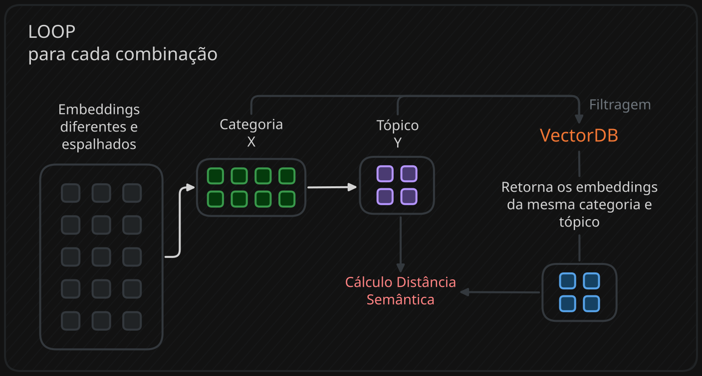

## Introdução
A classificação utiliza a herança por proximidade semântica, então se o fragmento novo tiver um problema muito parecido com um já definido no vectorDB(problema conhecido), ele herdará o resumeID ou algum outro dado da sua escolha.

**O que é resumeID?:**
> É um texto padronizado que explica um problema conhecido, por isso, fragmentos marcados como próximos vão ter o mesmo resumeID. Essa estratégia permite monitorar a frequência de problemas recorrentes com base na sua contagem.
### Qual a função do VectorDB nessa etapa?
É responsável por armazenar os embeddings que possuem um resumeID, servindo como modelo de comparação para os novos fragmentos.

> Os problemas desconhecidos vão para a fila RAG, alimentam a gold e depois se tornam modelos para comparações futuras.

### O Problema da VECTOR_SEARCH()
A função compara o embedding novo com todos do vectorDB até descobrir o mais próximo, porém, não existe garantia que um fragmento seja comparado com outro de mesma categoria, tópico ou sentimento, comprometendo a herança e gerando custos extras com RAG.

A solução seria o vectorDB entregar apenas os embeddings que possuem os mesmos rótulos, mas não é tão fácil quanto parece. Até o momento, encontrei duas formas de filtragem:
#### **Pré-cálculo:**
- **Lote/batch**: junta todos os fragmentos com a mesma combinação de rótulos, filtra o vectorDB, faz o cálculo e parte pro próximo lote.
> Cada lote traz o vectorDB para memória uma vez e processa vários ao mesmo tempo.

- **Linha a linha**: o fragmento chega, filtra o vectorDB com sua categoria, tópico e sentimento, faz o cálculo e parte pra próxima linha.
> Cada linha precisaria ler o VectorDB e jogar na memória - Inviável para o modelo ON DEMAND.
#### **Pós-cálculo**: 
cada embedding novo seria comparado com todo o vectorDB, mas ao final utiliza o filtro `WHERE` para verificar se possuem os mesmos rótulo.
> O vectorDB é retroalimentado pelo RAG, problemas desconhecidos são inseridos nele, então a longo prazo o processo se torna mais caro.
### Resolvendo o problema: Filtragem Batch + VECTOR_SEARCH()
A solução encontrada utiliza um loop que organiza os embeddings de diferentes categorias, tópicos e sentimento em um processo em batch para cada combinação de rótulos.

O projeto utiliza o jogo Mimesis como base e por isso foram construídos 2 categorias, 8 tópicos e 3 sentimentos(com 2 sendo exclusivos de uma só categoria). Para cada combinação de rótulos, é feito a filtragem da tabela de fragmentos e o vectorDB, garantindo uma comparação justa.

> Vale ressaltar que o **máximo** são 24 combinações, resultando em 24 leituras do vectorDB, mas na prática, podem chegar apenas 100 fragmentos de 5 combinações, resultando em 5 leituras.
> 
> Para aumentar a performance e economia, o vectorDB deve estar clusterizado por categoria, tópico e sentimentos. O uso do índice vetorial pra esse projeto não é recomendado.




``` SQL
-- 1. Em casos de retry o insert into começa do zero.
-- 2. Guarda o resultado da classificação para o direcionamento dos dados posteriormente no códio.
    CREATE OR REPLACE TEMP TABLE router_table (
        ai_split_id STRING,
        status STRING,
        resume_id STRING
    );

    -- 3. Loop de isolamento perfeito: category(2), topic(8), sentiment(3)
    FOR combination IN (
        SELECT DISTINCT category, topic, sentiment 
        FROM `project.dataset.temporaria_3`
    )
    DO
        INSERT INTO router_table
        SELECT
            query.ai_split_id,
            -- Problema desconhecido - distante
            CASE 
                WHEN distance <= limite_distancia THEN 'OK' 
                ELSE 'Revisão' 
            END AS status,
            -- Problema conhecido - perto
            CASE 
                WHEN distance <= limite_distancia THEN base.resume_id 
                ELSE NULL 
            END AS resume_id
            
        FROM VECTOR_SEARCH(
            -- VectorDB (BASE) (Possuem o ResumeID)
            (
                SELECT ai_split_id, category, topic, sentiment, embedding, resume_id 
                FROM `project.dataset.VectorDB_reviews` 
                WHERE category = combination.category 
                    AND topic = combination.topic
                    AND sentiment = combination.sentiment
            ),
            'embedding',
            -- Novos Embeddings (QUERY) (Novos Fragmentos)
            (
                SELECT ai_split_id, category, topic, sentiment, embedding 
                FROM `project.dataset.temporaria_3` 
                WHERE category = combination.category 
                    AND topic = combination.topic
                    AND sentiment = combination.sentiment
            ),
            'embedding',
            top_k => 1 -- pega apenas o mais próximo,
            options => '{"distance_type": "COSINE"}'
        );
    END FOR;

    -- 4. PARA COMBINAÇÕES NOVAS
    INSERT INTO router_table
        SELECT 
            ai_split_id, 
            'Revisão' AS status, 
            NULL AS resume_id
        FROM `project.dataset.temporaria_3`
        WHERE ai_split_id NOT IN (SELECT ai_split_id FROM router_table);
```