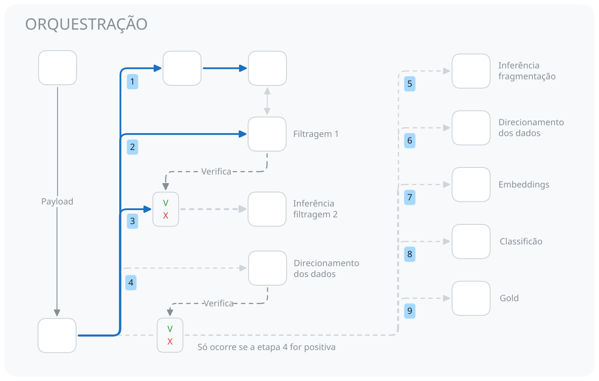

# 🎮 Steam Reviews Pipeline: DataOps & NLP/MLOps no Google Cloud

[](https://cloud.google.com/)
[](https://deepmind.google/technologies/gemini/)

# Como funciona o pipeline?
O pipeline mistura o ELT tradicional com o uso de **IA**, **Embddings**, **VectorDB** e **RAG** na etapa de transformação dos dados, tudo isso para lidar com os problemas específicos da Steam e entregar apenas o que é útil aos desenvolvedores/empresas de jogos.

## Volume dos dados
**Frequência das Reviews:** os jogadores não são obrigados a criarem uma review, então a quantidade diária pode variar muito, pois vai depender do sucesso do jogo, o seu alcance e impacto no jogador.

Por causa disso, pode ocorrer 3 situações que impactam as cotas do projeto:
1. **Nenhuma review nova foi extraída** -> gasto com Cloud Run, GCS e BQ que poderiam ser evitados.
2. **Existem review novas, mas todas são barradas no corte ou regex** -> gastos anteriores e sem motivo para continuar o pipeline.
3. **Nenhuma review passou pelo filtro da IA** -> gastos anteriores e sem motivo para continuar o pipeline.

> Tempo de execução / sistema de verificação e encerramento

## ⚙️ Quais serviços do GCP utilizados
1. Scheduler(serveless - cotas)
2. Workflow(serveless - cotas)
3. Cloud Run(serveless - cotas)
4. Cloud Storage(cotas)
5. Big Query(ON-DEMAND - cotas)
6. Agent Platform(sem cota - tem que pagar)

> Vale ressaltar que nem todas as regiões disponibilizam essas cotas e, se existir trafego de rede entre regiões diferentes, vão ser cobrados. Por isso **verifique a documentação oficial**.

## 🛠️ Como são utilizados?
**Scheduler:** Ativa o worflow e envia o payload(menos de 1mb) a cada 5 dias(tempo de criação das reviews)

**Workflow:** faz a orquestação do do cloud run, procedures no BQ, verificação de continuidade, cria o job de inferência em lote.

**Cloud Run:** responsável por extrair as reviews da API da Steam via httpx e fazer o pré-processamento para parquet utilizando polars.
- Processo idempotente
- Extrai apenas dados novos e atualiza a tabela Control_table_extraction para extrações futuras.
- Faz uma pré-filtragem que ignora as reviews vazias(lixo que seria armazenado na cloud)

**Big Query:** 
- Transformação: Corte, Regex, Array Struct, Joins, micro-batch(na classificação)
- Pré-inferência: config da IA + prompt + conteúdo = coluna request
- Direcionamento: os dados vão para tabelas específicas de forma incremental e idempotente
- Modelo Remoto: cria conexão específica para utilizar os embeddings do Agent Platform.
- Otimizações: partição, clusterização e storing(vetores apenas) nas tabelas.

**Agent Platform:**
- Gemini 3.1-flash-lite(global) na parte final da filtragem e na fragmentação apenas 
- Embedding Gemini 001(região) via modelo remoto

## 🏗️ Arquitetura e Fluxo de Dados

A execução é orquestrada de ponta a ponta sem a necessidade de manter servidores ativos (Zero Infrastructure Management):



## Observações antes da execução
**Tabelas Temporárias**: usadas para evitar gastos com tokens e embeddings em casos de falhas ou retrys - são deletadas ao final do pipeline ou em términos controlados. 

**Tabela de Controle:** centraliza os logs de conclusão na tabela *logs_tabela_controle_geral*, servindo para processos de verificação para idempotência.

**Procedure de logs**: para melhorar a manutenção do código, o procesos que registra os logs foram transformados em uma procedure para atuar como função:
- PRC_logs_control_table(X) -> insert na tabela controle com o status, data e timestamp

## 📁 Guia das Pastas

```Plaintext
├── bigquery/
│   └── procedures/
│       ├── flow/           # Lógica do pipeline (Regex, Fragmentação, Classificação,...)
│       ├── setup/          # Tabelas do projeto(Ordem de criação setup -> utilidades -> flow)
│       └── utilidades/     # Funções auxiliares (Log específico para idempotência e auditoria)
├── cloud-run/
│   └── Steam-API-extractor/
│       ├── dockerfile      # Definição do container isolado de extração
│       ├── main.py         # Script python para extração, pré-processamento e consulta no BQ
│       └── requirements.txt # Bibliotecas utilizadas, suas versões e SDK Oficial do GCP
├── workflows/
│   └── workflow.yaml       # Orquestração serveless completa.
```

## 🌐 Transparência com o Deploy
O meu objetivo é construir uma solução para o problema da Steam enquanto aprendia sobre o GCP, mas existem conteúdos vindos das reviews que podem violar termos de serviços e, enquanto não encontro uma solução segura, o deploy não será entregue - evitando que outras pessoas se prejudiquem.

