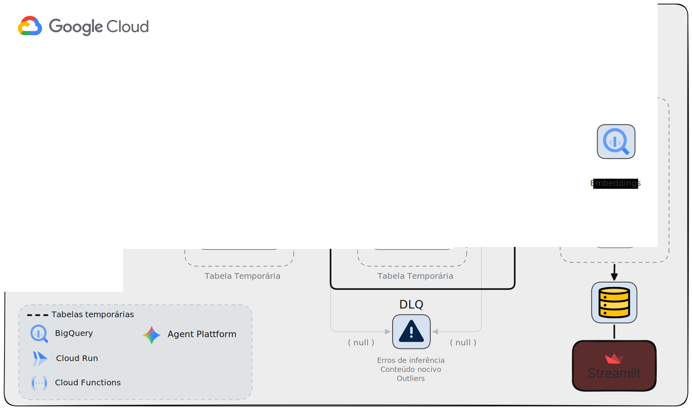
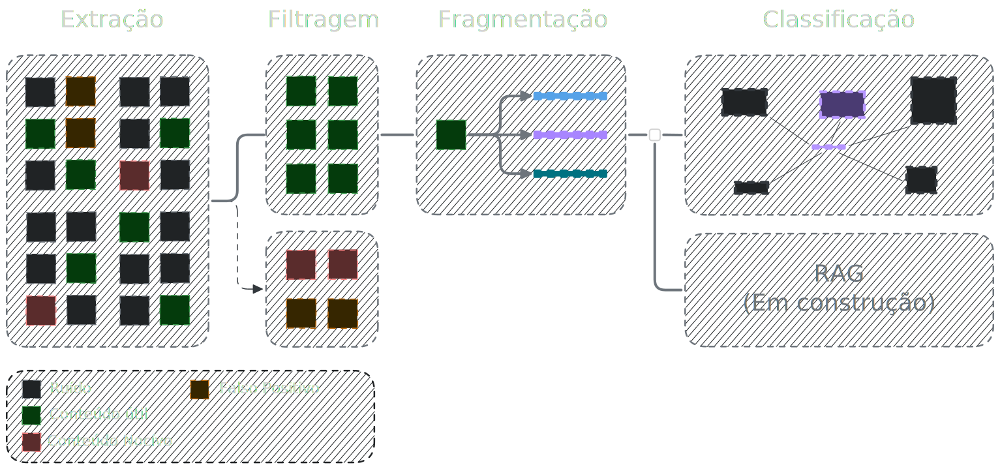
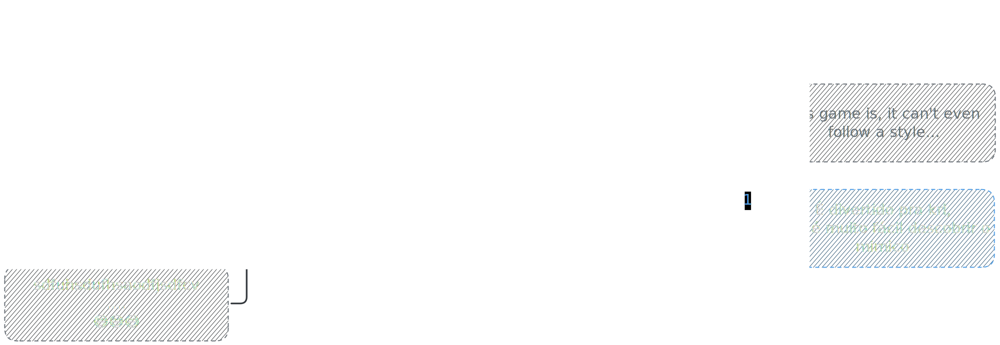
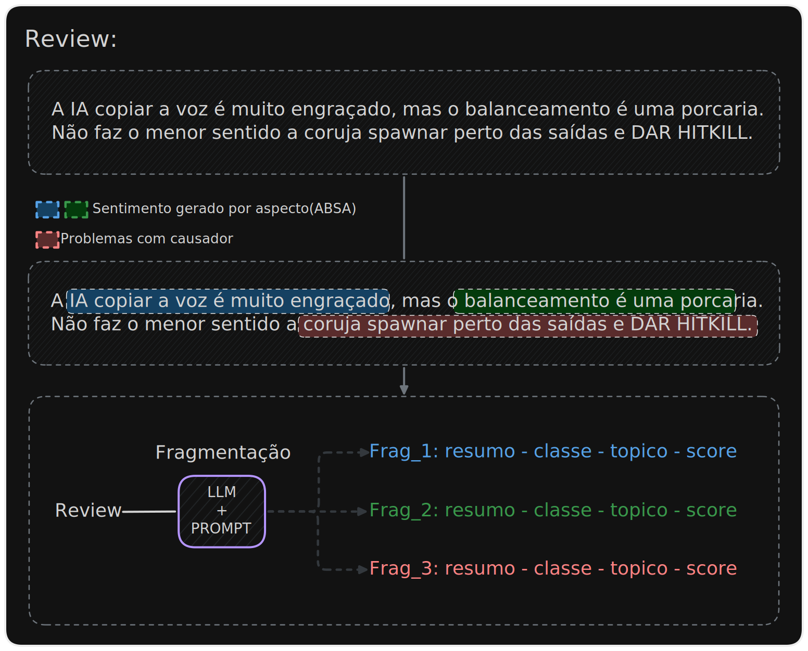
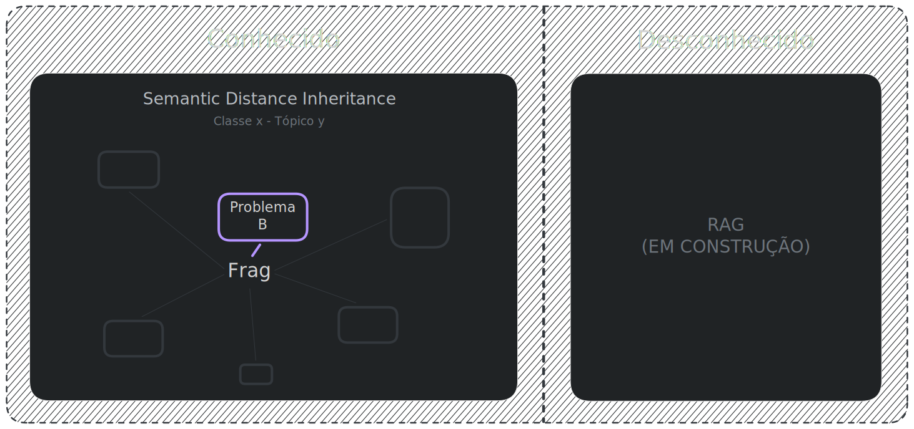

# Introdução
Early Acess nos jogos é uma modalidade onde os desenvolvedores vendem o jogo ainda em desenvolvimento, utilizando o dinheiro para manter o projeto vivo para ter um lançamento oficial. Por isso, os feedbacks dos jogadores são os dados mais valiosos, pois permitem encontrar rapidamente quais problemas e áreas são prioridades nas atualizações.

No entanto, são os fatos que estão dentro do texto que geram essa importância, mas garantir que elas cheguem de forma automática para os devs exige inúmeras técnicas de NLP. É por isso que mesmo sendo a maior plataforma de jogos do mundo, as reviews da Steam são um pesadelo para os devs. Pensando nisso, essa arquitetura de dados propõe uma solução eficiente que une engenharia de dados + IA para resolver esse problema.

*🎈 Ao fim da vida, nenhuma dessas tecnologias vai para baixo da terra, mas o ser humano cego pelo próprio ego, sim. Por isso, me esforcei ao máximo para que qualquer pessoa possa aprender algo aqui.*


## Por que as reviews da Steam são complexas de lidar?
A plataforma permite uma estrutura livre na construção das reivews: o usuário pode escrever o que quiser, da forma que achar melhor e enviar. Ao analisar o conteúdo causado por essa liberdade, percebe-se que a complexidade não está só em gírias, erros gramaticais ou emojis, mas sim uma lista de problemas(tabela abaixo), que vão do mais simples aos que violam os termos de serviço de LLMs.

|Ruídos|Complexidade|Soluções|Lado negativo|
|---|---|---|---|
|EMOJIS|Fácil|SQL + REGEX|Custo Computacional|
|Sentimentos genéricos|Fácil|SQL + REGEX|Custo Computacional|
|ASCII ART(simples e complexa)|Média|SQL + REGEX|Custo Computacional|
|Assuntos aleatórios|ALTA|PROMPT + LLM|Inferência, falsos positivos, tokens, prompt e modelo|
|Reclamações/Problemas sem causador|ALTA|PROMPT + LLM|Inferência, falsos positivos, tokens, prompt e modelo|
|Copy Pastas|MÁXIMA|PROMPT + LLM|Inferência, falsos positivos, tokens, prompt e modelo|
|Spam de caracteres espaçados|MÁXIMA|INDEFINIDO|Alto custo computacional sem garantias de sucesso|
|Conteúdos nocivos|MÁXIMA|INDEFINIDO|Risco aos termos de serviços da IA|
---
<br>
<br>

# Engenharia de dados + IA: os 3 pilares

<br>
<p align="center">
  
</p>

## Filtragem(maior redutor de custos com IA)
 A filtragem é a etapa mais importante da arquitetura, pois quanto menos eficiente for as técnicas de filtragem, mais ruídos serão processados, o que compromete as etapas posteriores. Do contrário, mais será o custo com tokens e mais dados de qualidade serão processado. Por isso, a filtragem foi dividida em duas partes até o momento: 

<p align="center">
  
</p>

*⚠ Está sendo estudado o uso de embeddings para remover conteúdos aleatórios/nocivos.*

## Fragmentação
O objetivo final é permitir que o desenvolvedor possa selecionar um topico e descobrir quais são os problemas mais recorrentes. Pra alcançar esse objetivo, os assuntos de uma review são fragmentados e isolados, além de criar um resumo que ajuda a leitura dos devs e aumenta a eficiencia da busca semantica(proxima etapa).

<br>

<p align="center">
  
</p>

## Classificação
Com a fragmentação, problemas recorrentes geram resumos semelhantes(o mesmo causador), o que permite separar o que é conhecido do desconhecido através da similaridade semântica. Ao metrificar a recorrência dos assuntos, é possível monitorar a efitividade dos updates e criar um sistemas de ranking.

<br>

<p align="center">
  
</p>

# Guia do Projeto e Observações

``` text
Projeto/
├── Explicação do Pipeline/
│   ├── Extação-Load/ # Como extrair os dados da STEAM de forma inteligente e lidar com seus problemas
│   ├── Transformação/
│   │   ├── Filtragem/ Explico como usei técnicas de NLP com SQL e o uso estratégico do Gemini
│	│   ├── Router/ Explica pra onde os dados vão pos inferencia de relevancia
│   │   ├── Fragmentação/
│	│   ├── Router/ Explica pra onde os dados vão pos inferencia de fragmentação
│   │   ├── Classificação/ Bigquery como vectorDB, herança semantica e etc
│   ├── Otimizações-Idempotência/
└── Pipeline/
```

A arquitetura foi projetada para ser eficiente com os recursos de IA e Embeddings, além de ser imdepotente. Os recursos de inferência são utilizados apenas se houver reviews marcadas como relevantes. 

O projeto foi criado inteiramente no Google Cloud Platafform usando os seguintes recursos:
- BigQuery
	- Otimização das tabelas para modelo ON-DEMAND
	- Procedures
	- Filtragem
	- Modelos Remotos
	- Pré-inferência(coluna request)
	- VectorDB
- Cloud Run/Function
	- Extração inteligente dos dados da Steam
	- Criação de Inferência flex/batch
- Agent Platafform
	- Gemini 3.1(filtragem / fragmentação)
	- Gemini Embeddings(Classificação)
- Cloud Workflow
	- orquestração inteligente das procedures e recursos de IA

